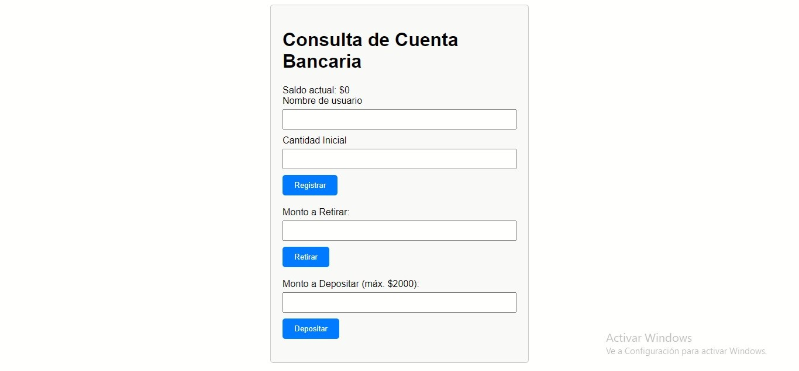

# Simulador de Banco

**Este pequeño proyecto fue realizado con fines practicos para entendender conceptos basicos de la programacion orientada a objetos.**
**El proyecto consta de un simple simulador de banco que te permite crear un usuario, asi como tambien a hacer retiros, depositos, y consultar tu saldo. Esto gracias  a que en POO es posible crear clases y agregar atributos y metodos que nos permiten hacer distintas acciones para poder manipular objetos.**

## Tecnologias:
- **HTML**
- **CSS**
- **JavaScript**

## Temas Vistos:
- **Programacion Orientada a Objetos**
- **Abstraccion**
- **Encapsulamiento**
- **Polimorfismo**

;
